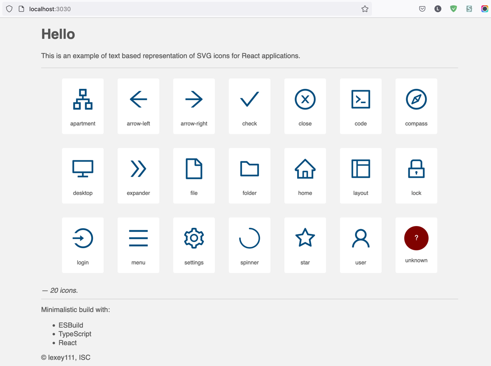

# Text Icons

Very minimalistic example of text based SVG icons approach for React applications.

Demonstrates the idea and basic usage.

## The Idea

The basic idea is to put the SVG markup in a text string - a field with a special structure - and create a desired icon
in runtime. This eliminates the need to download a file (with a network request) or worry about CSP when the data is CSS
encoded.

## Quick start

1. `git clone`
2. `npm i`
3. `npm run start` to run devserver on [http://localhost:3030](http://localhost:3030)

To just build the application (despite it has very little sense) use

* `npm run build` or `npm run build:dev`
* `npm run watch` for watch mode.

The compiled files are in the `./dist` folder.



### Bonus

The project itself is tiny but fully operational "Starter Kit" for ESBuild + TypeScript + React. Feel free to use it as a template.

To expand it to the "enterprise" level, you can easily add here:

* SASS/LESS support
* Static assets (fonts, images etc.)
* ESLint for TS + CSS (style check)
* Jest + Enzyme + Playwright runners - Unit Tests and e2e Tests
* More sophisticated and performant HTTP server (Koa).

If there are enough requests, I will do so.

## Where to get the icons

Well, where you find unlicensed icons.

Perhaps, [FA](https://github.com/FortAwesome/Font-Awesome/tree/master/svgs/regular). Just choose an icon,
click on it, open source (`<>` icon) and copy the text.

Then open Icon Map file and paste text there:

```tsx
export const IconsMap: TIconMapEntry = {
    apartment: <path d="..." / >,

    'name-of-your-icon': < % paste CONTENT without headers % > 
}
```

There are a few rules:

1. Keep alphabetic order.

2. If the SVG has more than one tag - embrace them with React.Fragment:

    ```tsx
    export const IconsMap: TIconMapEntry = {
        close: <> { // <-- here it is }
            <path d="..."/>
            <path d="..."/>
        </>,
    }
   ```
   
3. If ViewBox is not default one (here: `64 64 896 896`, please don't forget to change it in `icon.component.tsx` if
   you're going to use other default size), you can use extended syntax:

   ```tsx
    export const IconsMap: TIconMapEntry = {
       spinner: {
            content: <path d="..."/>,
            viewBox: '0 0 1024 1024', { // <-- here }
            ownClass: 'spinner' { // to add specific class to the icon }
        }
   }
   ```

Enjoy!
